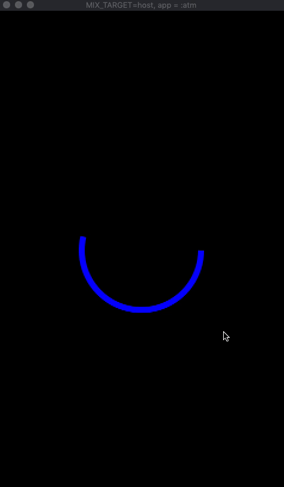

# Scenic.Loader



A simple loading spinner. Under the hood, it is just an arc that gets
some fancy animation. It takes no data, so any argument to `add_to_graph/3` is
ignored, but it accepts all the options of `Scenic.Primitive.Arc` as they are
just passed in directly.

```elixir
Scenic.Loader.add_to_graph(graph, t: {200, 400}, stroke: {50, :red})
```

Or, for that syntactic sugar, you can import the component for `loader/2`

```elixir
loader(graph, t: {200, 400}, stroke: {50, :red})
```

If you don't supply an `id`, then it will default to `:loader`. Once you're done
doing "work", you can just delete the loader from the scene (or replace it).
There is also a helper for that:

Via module:
```elixir
Scenic.Loader.stop()
```

Via imported helper functions:
```elixir
stop_loader(:my_id)
```
